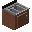

# Independent Tech

## [Farmer's Delight](https://github.com/vectorwing/FarmersDelight/tree/1.21) (MIT License)

> [!TIP]
> This project includes a block adapted from Farmer's Delight.

-  Basket

## [Cooking For Blockheads](https://github.com/TwelveIterationMods/CookingForBlockheads/) (WIP)

-  Sink

## [Supplementaries](https://github.com/MehVahdJukaar/Supplementaries) (TODO)

-  Faucet
-  Cog Block

## [Create](https://github.com/Creators-of-Create/Create) (TODO)

-  Powered Toggle Latch