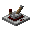

# Independent Tech

## [Farmer's Delight](https://github.com/vectorwing/FarmersDelight/tree/1.21)

> [!TIP]
> MIT License
> This project includes a block adapted from Farmer's Delight.

-  Basket

## [Cooking For Blockheads](https://github.com/TwelveIterationMods/CookingForBlockheads/) (WIP)

> [!TIP]
> ARR
> This project includes blocks adapted from Cooking For Blockheads.

-  Sink

## [Supplementaries](https://github.com/MehVahdJukaar/Supplementaries) (TODO)

> [!TIP]
> Supplementaries Team License
> This project includes blocks adapted from Supplementaries.

-  Faucet
-  Cog Block

## [Create](https://github.com/Creators-of-Create/Create) (TODO)

> [!TIP]
> MIT License
> This project includes blocks adapted from Create.

-  Powered Toggle Latch